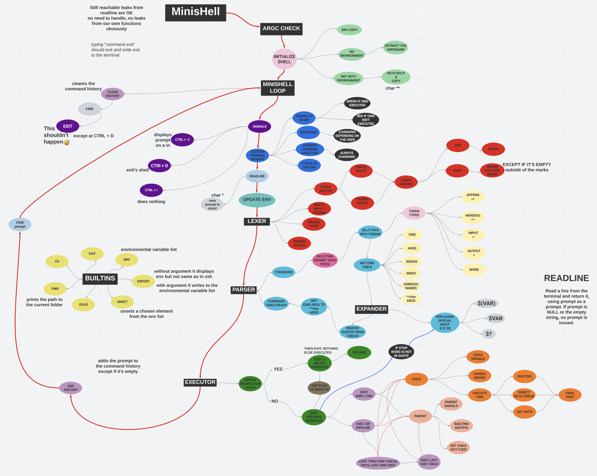

# ❤️ Minishell ❤️
The objective of this project is for you to create a simple shell.
## Helpful Assets
### Allowed Function Overview:
[Click Here](assets/functions.md) or go to `assets/functions.md`.
### Minishell Overview:

### Ioctl On Non-Campus Computers:
```
sudo sysctl -w dev.tty.legacy_tiocsti=1
```
This command needs to be called every time you start your non-campus computer.
